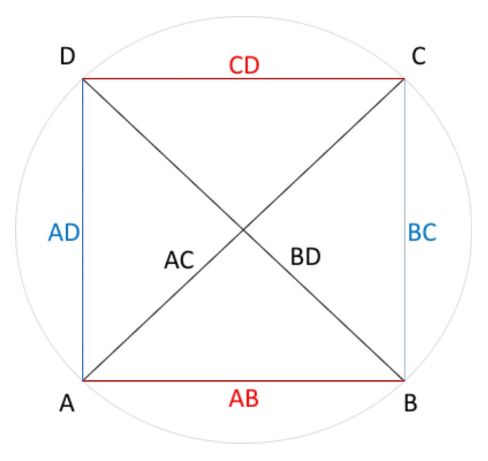
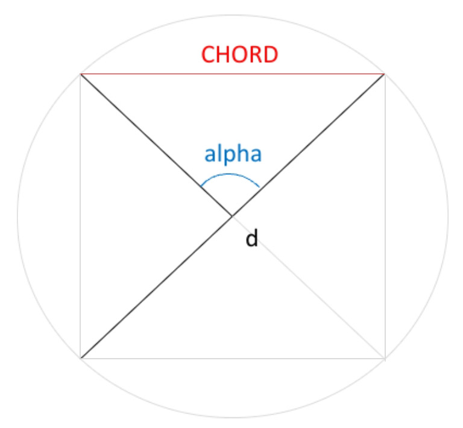

# Ptolemy's table of chords

Famous table of chord lengths according to Ptolemy's *Almagest* (e.g. 1515) converted into decimal values ​​and calculated in comparison using the sine function, see Toomer (1984).
Chord lengths $l_0$ are calculated according to *Ptolemy's theorem* (fig. 1) as the relation between four sides and two diagonals of a cyclic quadrilateral where

$$AC⋅BD = AB⋅CD + BC⋅AD.$$

Chord lengths $l_0$ (fig 2.) are expressed in fractional parts of sexagesimal numerals $x$ $y$ $z.$ Decimal values $l_1$ are calculated as

$$l_1=x+\frac{y}{60}+\frac{z}{60^2}.$$

*Sixtieths* is the average interpolation number to be added to lenght $l_0$ or $l_1$ each time angle increases by one minute of arc, that is $n=30$ times per half angle degree $\alpha$.

Lengths $l_2$ to given arcus $\alpha$ and diameter $d$ are calculated using the sine function where

$$l_2=d⋅sin\frac{\alpha⋅\pi}{360}.$$

Differences $diff$ show the difference between (1) *sixtieth* and arithmetical interpolation as well as the difference between (2) the calculation types of chord lengths $l_1$ and $l_2$, see `chord.md` or `chord.xlsx` tables.

### References

Ptolemaeus, C. (1515). *Almagestum CL. Ptolemei Pheludiensis Alexandrini astronomorum principis opus ingens ac nobile omnes celoru motus continens.* Felicibus astris eat in lucem ductu Petri Liechtenstein coloniensis germani ...Venetiis. [https://doi.org/10.3931/e-rara-206](https://doi.org/10.3931/e-rara-206)

Toomer, G. J. (1984). *Ptolomey's Almagest*. Duckworth, London & Springer, New York. [https://www.cambridge.org/core/journals/journal-of-hellenic-studies/article/abs/ptolemy-almagest-trans-and-ed-g-j-toomer](https://www.cambridge.org/core/journals/journal-of-hellenic-studies/article/abs/ptolemy-almagest-trans-and-ed-g-j-toomer-duckworth-classical-medieval-and-renaissance-editions-london-duckworth-1984-pp-ix-693-5500/A1F58AE8EB313960DD85E38B7C806426)
