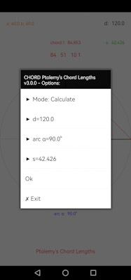
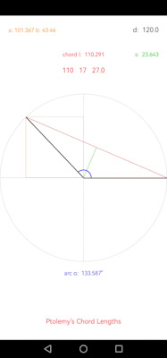
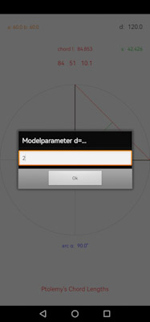

# Ptolemy's table of chords

Famous table of chord lengths according to Ptolemy's *Almagest* (e.g. 1515) converted into decimal values and calculated in comparison using the sine function, see e.g. Halma (1813) or Toomer (1984).
Chord lengths $l_0$ are calculated according to *Ptolemy's theorem* (fig. 1) as the relation between four sides and two diagonals of a cyclic quadrilateral where

$$AC⋅BD = AB⋅CD + BC⋅AD.$$

Chord lengths $l_0$ (fig. 2) are expressed in fractional parts of sexagesimal numerals $x$ $y$ $z.$ Decimal values $l_1$ are calculated as

$$l_1=x+\frac{y}{60}+\frac{z}{60^2}.$$

*Sixtieths* is the average interpolation number to be added to length $l_0$ or $l_1$ each time angle increases by one minute of arc, that is $n=30$ times per half angle degree $\alpha$.

Lengths $l_2$ to given arcus $\alpha$ and diameter $d$ are calculated using the sine function where

$$l_2=d⋅\sin\frac{\alpha⋅\pi}{360}.$$

This is equivalent in terms of content to distance $s$ or radius $r$ determination via angular expansion $V$ with 

$$r=s⋅\tan(\frac{V}{2}).$$

In the absence of trigonometric sine functions, however, no *calculation* was made with distance parameters $s$, but tabularized values from previous model calculations by means of the Pytagoraean theorem 

$$a^2+b^2=c^2$$

were used and interpolated to the corresponding angle values of expansion:  

The parameters can then be adapted to empirical proportions by transforming the model parameter $d=120$:

Differences $diff$ show the difference between (1) *sixtieth* and arithmetical interpolation as well as the difference between (2) the calculation types of chord lengths $l_1$ and $l_2$, see `chords.md` or `chords.xlsx` tables.  
Using this method in addition to methods for parallax determination, Ptolemy was able to determine e.g. Moon's distance with $d=59$ Earth radii ($er$) and radius $r=0.29er$, where $er=6378km$, quite accurate (see e.g. Goldstein, 1967).

### References
Goldstein, B. R. (1967). The Arabic Version of Ptolemy’s Planetary Hypotheses. *Transactions of the American Philosophical Society, 57*(4), 3-55. [DOI:10.2307/1006040](https://doi.org/10.2307/1006040)

Halma, N. (1813). *COMPOSITION MATHÉMATIQUE DE CLAUDE PTOLÉMÉE.* TRADUITE POUR LA PREMIÈRE FOIS DU GREC EN FRANÇAIS, SUR LES MANUSCRITS ORIGINAUX DE LA BIBLIOTHÈQUE IMPÉRIALE DE PARIS, Par M. HALMA; ET SUIVIE DES NOTES DE M. DELAMBRE, ... A PARIS, CHEZ HENRI GRAND, LIBRAIRE, RUE SAINT-ANDRÉ-DES-ARCS, N° 51.
[https://ia600202.us.archive.org/12/items/bub_gb_a9nvvbG-OOIC/bub_gb_a9nvvbG-OOIC.pdf](https://ia600202.us.archive.org/12/items/bub_gb_a9nvvbG-OOIC/bub_gb_a9nvvbG-OOIC.pdf)

Ptolemaeus, C. (1515). *Almagestum CL. Ptolemei Pheludiensis Alexandrini astronomorum principis opus ingens ac nobile omnes celoru motus continens.* Felicibus astris eat in lucem ductu Petri Liechtenstein coloniensis germani ...Venetiis. [https://doi.org/10.3931/e-rara-206](https://doi.org/10.3931/e-rara-206)

Toomer, G. J. (1984). *Ptolemy's Almagest*. Duckworth, London & Springer, New York. [https://www.cambridge.org/core/journals/journal-of-hellenic-studies/article/abs/ptolemy-almagest-trans-and-ed-g-j-toomer](https://www.cambridge.org/core/journals/journal-of-hellenic-studies/article/abs/ptolemy-almagest-trans-and-ed-g-j-toomer-duckworth-classical-medieval-and-renaissance-editions-london-duckworth-1984-pp-ix-693-5500/A1F58AE8EB313960DD85E38B7C806426)
