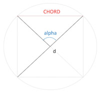

# Ptolemy's table of chords
[Demo movie](https://m.youtube.com/watch?v=xUpBBr5btvk)

`CHORD` application for Android (Schrausser, 2023): Famous table of chord lengths according to Ptolemy's *Almagest* (1515, fol. 7r ff.) converted into decimal values and calculated in comparison using the sine function, see Halma (1813, p. 38 ff.),  Heiberg (1898, p. 48 ff.) or Toomer (1984, p. 57 ff., 1998, res.).  
Chord lengths $l_0$ are calculated according to *Ptolemy's theorem* (fig. 1) within the relation between four sides and two diagonals of a cyclic quadrilateral where

$$AC⋅BD = AB⋅CD + BC⋅AD.$$

Figure 1.

Chord lengths $l_0$ (fig. 2) are expressed in fractional parts of sexagesimal numerals $x$ $y$ $z.$ Decimal values $l_1$ are calculated as

$$l_1=x+\frac{y}{60}+\frac{z}{60^2}.$$

Figure 2.

*Sixtieths* is the average interpolation number to be added to length $l_0$ or $l_1$ each time angle increases by one minute of arc, that is $n=30$ times per half angle degree $\alpha$.  
Lengths $l_2$ to given arcus $\alpha$ and diameter $d$ are calculated using the sine function, where

$$l_2=d⋅\sin\frac{\alpha⋅\pi}{360}.$$

This is equivalent in terms of content to distance $s$ or radius $r$ determination via angular diameter $V$ with 

$$r=s⋅\tan\frac{V}{2}.$$

In the absence of trigonometric sine functions, however, no *calculation* was made with distance parameters $s$, but tabularized values from previous model calculations with given $d=120$ by means of the *Pythagorean theorem*

$$a^2+b^2=c^2$$

were used and interpolated to the corresponding angle values of expansion:  

Figure 3.

Chord parameters $l_{(120)}$ can then be adapted to empirical $l_{(d)}$ proportions by transforming the model parameter with

$$l_{(d)} = l_{(120)}⋅\frac{d}{120}.$$

Chord length values $l_{(d)}$ corresponding to *empirical* distances $s$ can be expressed by multiplying with a ratio factor $\delta$ as $l_{(e)}=l_{(d)}⋅\delta$ to given angle $\alpha$, where according to *Pythagoras* 

$$\delta=s⋅\Biggl(\frac{D}{2}^2-\frac{L}{2}^2\Biggr)^{-\frac{1}{2}}.$$

Differences $diff$ show the difference between (1) *sixtieth* and arithmetical interpolation as well as the difference between (2) the calculation types of chord lengths $l_1$ and $l_2$, see `chords.md` or `chords.xlsx` tables.  
Using this method along with methods for parallax determination, Ptolemy was able to determine e.g. Moon's *distance* and *radius* quite accurate:
>"We have explained in the Almagest [...] that the least distance of the Moon is 33 earth radii, and its greatest distance 64 earth radii [...]", (Goldstein, 1967, p. 7).

### References
Goldstein, B. R. (1967). The Arabic Version of Ptolemy’s Planetary Hypotheses. *Transactions of the American Philosophical Society, 57*(4), 3-55. [DOI:10.2307/1006040](https://doi.org/10.2307/1006040)

Halma, N. (1813). *Composition mathématique de Claude Ptolémée.* Traduite pour la première fois du grec en français, sur les manuscrits originaux de la Bibliothèque Impériale de Paris, par M. Halma; et suivie des notes de M. Delambre, ... A Paris, chez Henri Grand, libraire, Rue Saint-André-des-Arcs, N° 51. (Mathematical composition of Claude Ptolemy. Translated for the first time from Greek into French, on the Original Manuscripts of the Imperial Library of Paris...)
[https://ia600202.us.archive.org/12/items/bub_gb_a9nvvbG-OOIC/bub_gb_a9nvvbG-OOIC.pdf](https://ia600202.us.archive.org/12/items/bub_gb_a9nvvbG-OOIC/bub_gb_a9nvvbG-OOIC.pdf)

Heiberg, J. L. (1898). *Claudii Ptolemaei Opera quae exstant omnia. Syntaxis Mathematica. Vol. 1. 1.* Lipsae: In aedibus B. G. Teubneri. [https://archive.org/details/pt1claudiiptolemaei01ptoluoft/page/n561/mode/2up](https://archive.org/details/pt1claudiiptolemaei01ptoluoft/page/n561/mode/2up)

Ptolemaeus, C. (1515). *Almagestum CL. Ptolemei Pheludiensis Alexandrini astronomorum principis: Opus ingens ac nobile omnes Caelorum motus continens.* Felicibus astris eat in lucem: Ductu Petri Liechtenstein Coloniensis Germani. Anno Virginei Partus, 1515, Die 10. Ia. Venetiis ex officina eiusdem litteraria. (Almagest of CL. Ptolemy Pheludiens, head of the Alexandrian astronomers: A great and noble work containing all the movements of the heavens...)
 [DOI:10.3931/e-rara-206](https://doi.org/10.3931/e-rara-206)

Schrausser, D. G. (2023). *Schrausser/Ptolemy-s-table-of-chords: Calculator (v3.5.2)*. Zenodo. [DOI:10.5281/zenodo.7948117](https://doi.org/10.5281/zenodo.7948117)

Toomer, G. J. (1984). *Ptolemy's Almagest*. Duckworth, London & Springer, New York. [https://www.cambridge.org/core/journals/journal-of-hellenic-studies/article/abs/ptolemy-almagest-trans-and-ed-g-j-toomer](https://www.cambridge.org/core/journals/journal-of-hellenic-studies/article/abs/ptolemy-almagest-trans-and-ed-g-j-toomer-duckworth-classical-medieval-and-renaissance-editions-london-duckworth-1984-pp-ix-693-5500/A1F58AE8EB313960DD85E38B7C806426)

———. (1998). *Ptolemy’s Almagest. Revised.* Princeton, NJ: Princeton University Press. [https://www.amazon.de/Ptolemys-Almagest-Ptolemy/dp/0691002606](https://www.amazon.de/Ptolemys-Almagest-Ptolemy/dp/0691002606)
